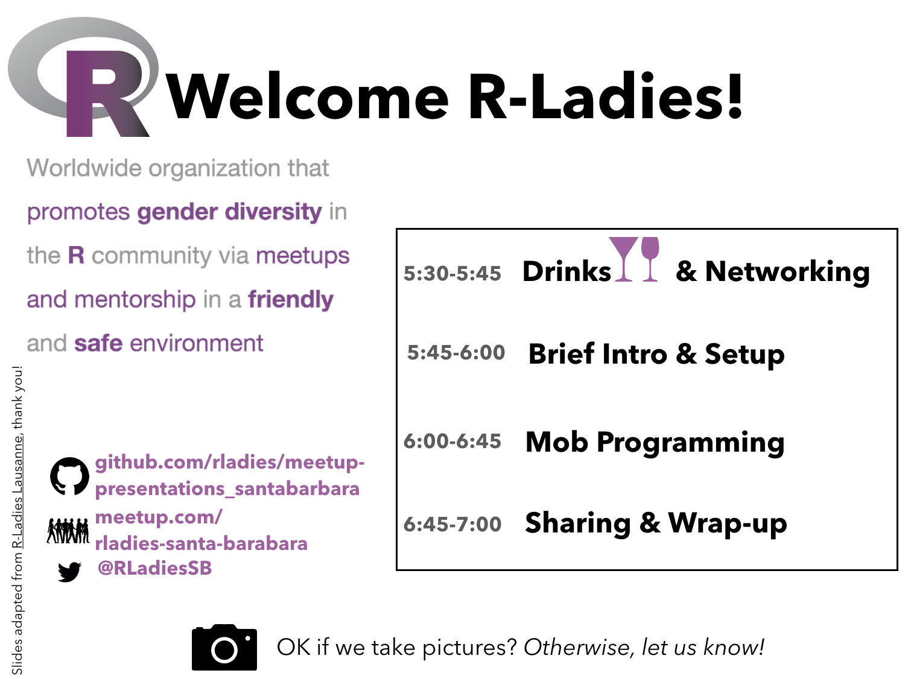
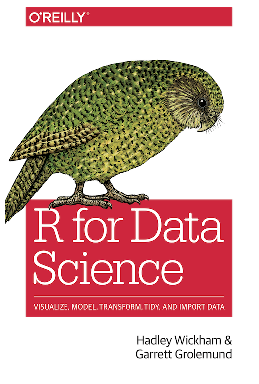

```{r setup, include=FALSE}
options(htmltools.dir.version = FALSE, warning=FALSE, message=FALSE, verbose = FALSE)

library(tidyverse)
np_visit <- suppressMessages(read_csv("data/np_visit.csv"))
```
<!---

--->
---
class: center, middle

# Mob Programming

a haiku:  

small teams, one laptop  
timed rotation, we all code    
always supportive  

<br>
<br>

[(read actual information here, compiled by R-Lady Irene Steves)](https://github.com/R-Meetup-SB/hackathon-201806/blob/master/mob-programming.Rmd)

---
class: center, inverse, middle

# The Plan

---

# National Parks data

We'll be exploring data for visits to US National Parks.  
Data are from the [National Park Service](irma.nps.gov/Stats/SSRSReports) from a [lesson](https://rawgit.com/allisonhorst/data-vis/master/data_vis_np.html) by R-Lady Allison Horst. 

--

Here is a brief look at the data:  


```{r}
tail(np_visit)
```

---

# National Parks data

```{r}
skimr::skim(np_visit)
```

---

# `ggplot2` with National Parks data

We'll be coding together with `ggplot2`

- `ggplot` is a graphics package specifically built to help you iteratively create customized graphs
- it is part of the `tidyverse` of R packages: [tidyverse.org](https://www.tidyverse.org/)

--

.pull-left[

]

.pull-right[
Visualization chapters: 

- [data visualisation](http://r4ds.had.co.nz/data-visualisation.html) 
- [graphics for communication](http://r4ds.had.co.nz/graphics-for-communication.html)
]

---

# Getting started with `ggplot2`

To make the most basic graph, you need to tell R three things:

1. You're using ggplot
1. What data is used to create the graph
1. What type of graph you want to create

...everything beyond that is optional (awesome) customization.

--

```{r, eval=FALSE}
ggplot(data = my_data, aes(x, y)) +
  geom_point() 
```

--

We'll be referring to the RStudio [data visualization cheatsheet](https://www.rstudio.com/resources/cheatsheets/) and [tidyverse reference](https://ggplot2.tidyverse.org/reference/) to make awesome plots!

---

# Quick demo

```{r, warning=FALSE, message=FALSE}
library(tidyverse)

np_visit <- read_csv("data/np_visit.csv")

dino_nm <- np_visit %>% 
  filter(park_name == "Dinosaur National Monument")
  
head(dino_nm)
```

---

# Quick demo

```{r, eval=FALSE}
ggplot(data = dino_nm, aes(x = year, y = visitors)) +
  geom_point()
```

---

# Quick demo

```{r, eval=FALSE}
ggplot(data = dino_nm, aes(x = year, y = visitors)) +
  geom_point()
```

.pull-left[
```{r, echo=FALSE}
ggplot(data = dino_nm, aes(x = year, y = visitors)) +
  geom_point()
```
]

---
class: center


---

# Your turn!

1. Break into teams with diverse skill levels

1. Use one computer that has RStudio installed

1. Go to <https://github.com/jules32/rladies-ggplot2>

1. Download with the green button or fork-and-clone 

Then, in RStudio: 

1. Open `national_parks_ggplot2.Rmd`

1. Walk through the demo code

1. Answer the questions provided, or ask your own!

1. Meetup and share with the whole group at 6:45 

---

