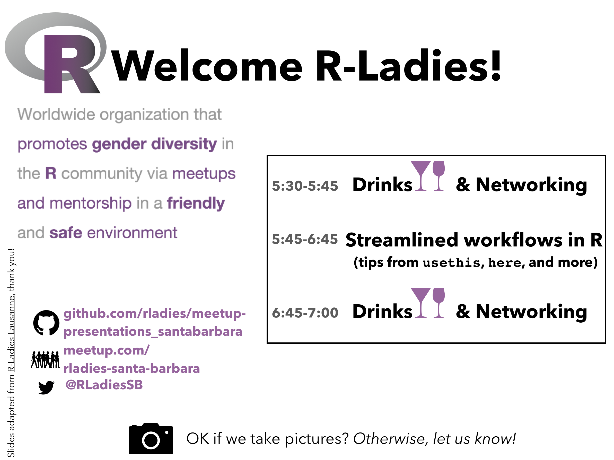
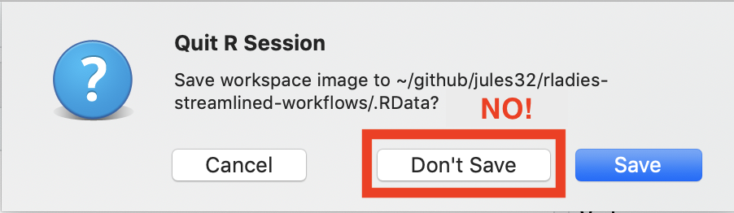
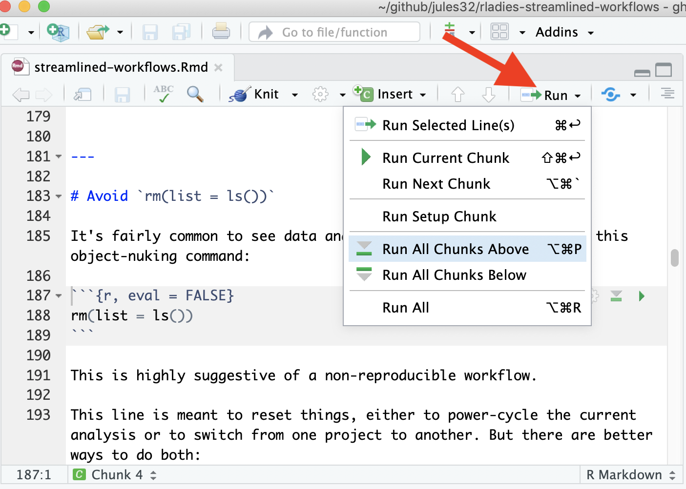
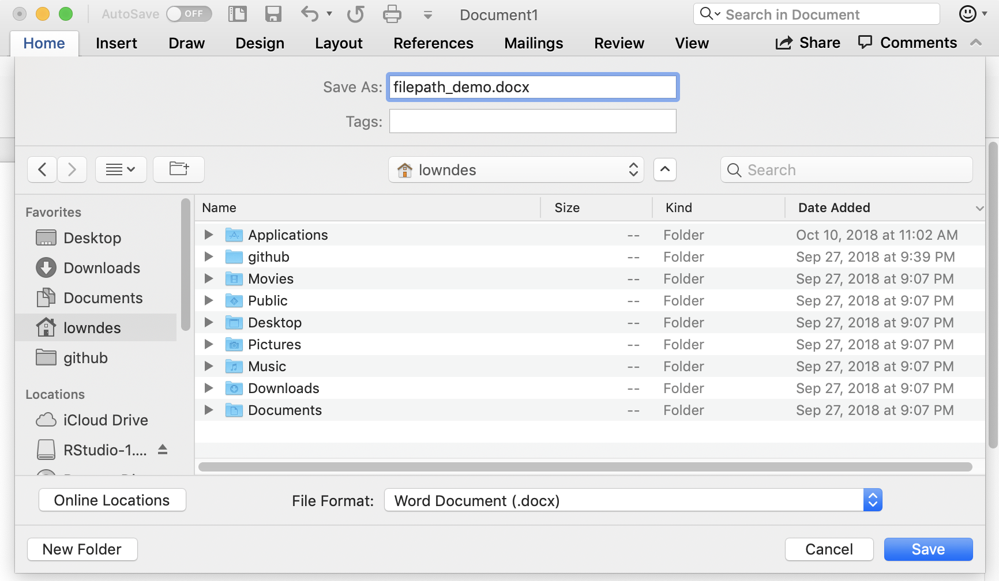

```{r setup, include=FALSE}
options(htmltools.dir.version = FALSE, warning=FALSE, message=FALSE, verbose = FALSE)

library(xaringan)
```




<!---We have a Code of Conduct.

We all take an active role in making RLadies a positive learning environment.
--->

---
# Today's goals

Showcase good practices for beginning and seasoned R users alike.  

Take some time to reflect on how we code or aspire to code: code for ourselves, our future selves, and others.

--

```{r ashamed, out.width = '70%', fig.align='center', echo = FALSE}
knitr::include_graphics("images/dont-be-ashamed-tweet.png")
```

<!---https://twitter.com/allimoberger/status/1085268564821585921--->
  
--

The motivation for this talk was to nudge me to learn more about `usethis` and `here`. But of course I found...

---
class: center, inverse, middle

# WTF


## What They Forgot to Teach You About R

<https://whattheyforgot.org>  

<br>
<br>
<br> 

💜 THANK YOU Jenny Bryan, Jim Hester, & so many other RStudio folks & RLadies 💜

💜 Most of this is exactly or build directly from the work of others 💜


---
#Today's plan
To streamline your workflows in R:

1. Save the source, not the workspace 
  - Always start R with a blank slate
  - Restart R often
  - Avoid `rm(list = ls())`
2. Filepaths
  - Avoid `setwd("path/that/only/works/on/my/machine")`
  - Use `here`
3. Organize work into Projects
  - Use an IDE
  - Name files deliberately 
  - Filepaths (reprise)  
4. (Bonus) `usethis`
  - Configure git
  - Create template READMEs and Rmds
  - Thank contributors
  - Add a Code of Conduct


---
class: center, inverse, middle

# 1. Saving source and blank slates


```{r beyonce, out.width = '100%', echo = FALSE}
knitr::include_graphics("images/if-you-liked-it-you-should-have-saved-the-source-for-it.jpg")
```

---
# Save the source, not the workspace.

Save the code that created the object, aka "source code"; do not save the object itself. 


<!--- this also works: 

--->


```{r out.width = '60%', fig.align='center', echo = FALSE}

```

--
  
  
- Everything that really matters should be achieved through code that you save – including objects and figures
  - The contrast is storing them implicitly or explicitly, as part of an entire workspace, or saving them via the mouse.  
  
- Saving code is an absolute requirement for reproducibility.

- Renouncing `.Rdata` and restarting R provide constant pressure for you to do the right thing.

---
# Use an IDE
(integrated development environment)

When working with R, save your commands in a `.R` file ("script"), or in `.Rmd` ("R Markdown document"). It doesn't have to be polished. Just save it!

An [integrated development environment](https://en.wikipedia.org/wiki/Integrated_development_environment) (IDE) is critical for making this workflow pleasant. 

--

Any good IDE offers: 

- a powerful, R-aware code editor 
- many ways to send your code to a running R process 
- other modern conveniences

This eliminates the temptation to develop code directly in the R Console. Instead, it becomes easier to do the right thing, which is to develop code in a `.R` or `.Rmd` file.

---

# Always start R with a blank slate

When you quit R, do not save the workspace to an `.Rdata` file. When you launch, do not reload the workspace from an `.Rdata` file.

In RStudio, set this via *Tools > Global Options*.

```{r fig.cap = "via R for Data Science", out.width = '40%', fig.align='center', echo = FALSE}
knitr::include_graphics("images/rstudio-workspace.png")
```

---

# Restart R often during development

> Have you tried turning it off and then on again?
>
> -- timeless troubleshooting wisdom, applies to everything

--

If you use RStudio, use the menu item *Session > Restart R* or the associated keyboard shortcut.  

Additional keyboard shortcuts make it easy to restart development where you left off, i.e. to say "re-run all the code up to HERE":

```{r run-above, out.width = '40%', fig.align='center', echo = FALSE}

```

---
# Avoid `rm(list = ls())`

It's fairly common to see data analysis scripts that begin with this object-nuking command:

```{r, eval = FALSE}
rm(list = ls())
```

This is highly suggestive of a non-reproducible workflow.

--

This line is meant to reset things, either to power-cycle the current analysis or to switch from one project to another. But there are better ways to do both:

- To power-cycle the current analysis, restart R!
- To switch from one project to another, either restart R or, even better, use an IDE with proper support for projects, where each project gets its own R process.

--

**The problem with `rm(list = ls())` is that, given the intent, it does not go far enough.**  

All it does is delete user-created objects from the global workspace.

---
background-image: url("https://media.giphy.com/media/3ofT5LPFIJ4EmC4Bgc/giphy.gif")
background-position: 50% 50%
class: center, inverse 

# 2. Filepaths 

---


# Filepaths preamble

- every saved thing gets a unique path 

```{r out.width = '60%', fig.align='center', echo = FALSE}

```

---

# Filepaths preamble

- every saved thing gets a unique path  

- your code runs from somewhere specific, and if it interacts with other things (data or other code), you need to tell your code where things are

--

- the more deliberate you are about where things live, 
  - the easier it will be for you & future you
  - the easier it will be for other people
  - the easier it will be for other computers

---

# setwd("path/that/only/works/on/my/machine")

This is unideal.

```{r, eval = FALSE}
library(ggplot2)
setwd("/Users/jenny/cuddly_broccoli/verbose_funicular/foofy/data")
df <- read.delim("raw_foofy_data.csv")
p <- ggplot(df, aes(x, y)) + geom_point()
ggsave("../figs/foofy_scatterplot.png")
```

--

The chance of the `setwd()` command having the desired effect -- making the file paths work -- for anyone besides its author is 0%. 

--

It's also unlikely to work for the author one or two years or computers from now. 

--

Hard-wired, absolute paths, especially when sprinkled throughout the code, make a project brittle. Such code does not travel well across time or space.

---
# setwd()

BUT, if you still decide to use `setwd()` in your scripts, you should at least be very disciplined about it:

- Only use `setwd()` at the very start of a file, i.e. in an obvious and predictable place. If someone has to hand-edit all of these, make it easy for them.  

- Always set working directory to the same thing, namely to the top-level of the project (not a subdirectory). Always build subsequent paths relative to that. 

---
# setwd() — compare: 

Unideal:

```{r unideal, eval = FALSE}
library(ggplot2)
setwd("/Users/jenny/cuddly_broccoli/verbose_funicular/foofy/data")
df <- read.delim("raw_foofy_data.csv")
p <- ggplot(df, aes(x, y)) + geom_point()
ggsave("../figs/foofy_scatterplot.png")
```

Less unideal: 

```{r less unideal, eval = FALSE}
setwd("/Users/jenny/cuddly_broccoli/verbose_funicular/foofy")
    
library(ggplot2)
df <- read.delim("data/raw_foofy_data.csv")
p <- ggplot(df, aes(x, y)) + geom_point()
ggsave("figs/foofy_scatterplot.png")
```


---

# setwd() — compare:

Way more ideal:

```
here::here()
```


Hang tight; we'll come back to this soon.

---
# If you like `setwd()`, then carry on

If you use `setwd("path/that/only/works/on/my/machine")` and it does not cause you or your collaborators grief, then I am happy for you. Carry on. This was my practice as well for many years.

Only you can decide how much you care about this (from [Jenny's original blog post](https://www.tidyverse.org/articles/2017/12/workflow-vs-script/)).

--

But eventually I admitted that this *did* cause me grief whenever I moved my files, collaborated on an analysis with a colleague, or got a new computer.

You can design this particular aggravation out of your life.


---
background-image: url("https://media.giphy.com/media/1SWiahmI5bbi0/giphy.gif")
background-size: 50% 50%
class: center, inverse
<!---https://www.w3schools.com/cssref/css3_pr_background-size.asp--->

# 3. Project-oriented workflows


---

# Dilemma and a solution

Problem statement:

  * We want to work on project A with R's working directory set to `path/to/projectA` and on project B with R's working directory set to `path/to/projectB`.
  * But we also want to keep code like `setwd("path/to/projectA")` out of our `.R` scripts.

--

I strongly recommend using an IDE that supports a project-based workflow. This eliminates the tension between your development convenience and the portability of the code.

---
# Organize work into projects
 
Here's what I mean by "work in a project":

- File system discipline: put all the files related to a project in a designated folder.

  - This applies to data, code, figures, notes, etc.
  - Depending on project complexity, you might enforce further organization into subfolders.

--

- Working directory intentionality: when working on project A, make sure working directory is set to project A's folder.
  - Ideally, this is achieved via the development workflow and tooling, not by baking absolute paths into the code.

--

- File path discipline: all paths are relative — relative to the project's folder.


---
# Organize work into projects

Synergistic habits: you'll get the biggest payoff if you practice all of them together.

--

Portability: the project can be moved around on your computer or onto other computers and will still "just work".This is the only practical convention that creates **reliable, polite behavior** across different computers/users/time. This convention is neither new, nor unique to R.

--

It's like agreeing that we will all drive on the left or the right. A hallmark of civilization is following conventions that constrain your behavior a little, in the name of public safety.

---
# RStudio Projects

The RStudio IDE has a notion of a (capital "P") [Project](https://support.rstudio.com/hc/en-us/articles/200526207-Using-Projects), which is a very effective implementation of the (small "p") projects described above. 

You can designate a new or existing folder as a Project. All this means is that RStudio leaves a file, e.g., `foofy.Rproj`, in the folder, which is used to store settings specific to that project. Use *File > New Project ...* to get started.

Double-click on a `.Rproj` file to open a fresh instance of RStudio, with the working directory and file browser pointed at the project folder.
  
  
---
# RStudio Projects
 
You can have multiple Projects going at once!

This allows rapid context switching across several projects, such as an R package, teaching material, and a data analysis. There is no danger of crosstalk between the projects: each has its own R process, global workspace, and working directory.

And, it's the same “unit” as a GitHub repo!


```{r out.width = '100%', echo = FALSE}
knitr::include_graphics("images/multiple-rstudio-projects.png")
```

---
# Where to keep Projects

One suggestion for organizing:

**Have a dedicated folder for your Projects.**  
Jenny: `~/rrr/`.   
Julie: `~/github/`.  

If you have One Main Place for Projects, then go there in Finder/File Explorer to launch any specific project with `.Rproj`.

---
# Tricks for opening Projects

Once you decide "I want to do some work in Project K", there are various ways to accelerate the startup process. 

**RStudio knows about recently used Projects.** Once you are in RStudio, there are several ways to access other Projects you've recently worked in. In the upper right corner is a drop-down menu with various Project- and session-related goodies in it.

.pull-left[
```{r out.width = '70%', echo = FALSE}
knitr::include_graphics("images/rstudio-project-switching.png")
```
]

.pull-right[
Use the "arrow and paper" icon to open a Project in a separate RStudio instance, while also leaving the Project you're launching it from open. 
]

---
background-image: url("images/here.png")
background-position: center
background-size: 75% 75%
class: center, inverse, bottom


---
# `here`

`here()` identifies your project's files, based on the current working directory at the time when the package is loaded.

```{r}
library(here)
here()
```

--

If you want to understand why, use `dr_here()`.  

If you need to set it manually, use `set_here()`.

Those are the only 3 functions in the `here()` package.

---
# `here` example: Foofy

This will run, with no edits, for anyone who follows the convention about launching R in the project folder.

```{r, eval=FALSE}
library(ggplot2)
library(here)

df <- read.delim(here("data", "raw_foofy_data.csv"))
p <- ggplot(df, aes(x, y)) + geom_point()
ggsave(here("figs", "foofy_scatterplot.png"))
```

--

In fact, it will even work if R’s working directory is anywhere inside the project, i.e. it will work from sub-folders. This plays well with knitr/rmarkdown’s default behavior around working directory and in package development/checking workflows.

---
# `here` example: Ocean Health Index

Constraint: Our R package that all OHI users use must be run from a subdirectory; in this case `esw/esw2018`

--

Baby steps — and definitely not the intended use but this is our reality:
```{r eval=FALSE}
setwd(here::here('esw2018'))
```

--

is a huge leap forward from 
```{r eval=FALSE}
setwd('~/github/esw/esw2018'))
```

But this way actually did serve us well for years, provided that everyone created this `~/github/` folder in their root directory.

---
# `here` example: Ocean Health Index

`here` is useful for us when we are working outside of projects. 

---
background-image: url("images/bryan-naming-files.png")
background-size: 50% 50%
class: center

#  Naming files


---
class: center, inverse, middle

# 4. Tips from `usethis`

---
## Configure Git

```{r, eval=FALSE}
## set the user's global user.name and user.email
use_git_config(user.name = "Jane", user.email = "jane@example.org")
```

-- 

## Identify contributors via GitHub activity

{r, eval=FALSE}
usethis::use_tidy_thanks("openscapes/demo")


<https://github.com/Openscapes/demo/graphs/contributors>

-- 

# Add an RMarkdown Template

Adds files and directories necessary to add a custom rmarkdown template to RStudio. It creates:

- `inst/rmarkdown/templates/{{template_dir}}`. Main directory.
- `skeleton/skeleton.Rmd`. Your template Rmd file.
- `template.yml` with basic information filled in.


```{r, eval=FALSE}
usethis::use_tidyrmarkdown_template()
```


---
# Use your new RMarkdown template

---

# Create README files

Live demo:

```{r, eval=FALSE}
usethis::use_readme_md()
```

And, let's make a README.Rmd and learn why we would ever want to:

```{r, eval=FALSE}
usethis::use_readme_rmd()
```

--- 

# Add a Code of Conduct
 

usethis::use_tidy_coc()

---
# Summary


---
# Next RLadies Meetup

- April — let's meetup for a drink or a hike
- May - led about SOMETHING COOL by YOU?
- July or August: Wikipedia with Joan Dudney!

