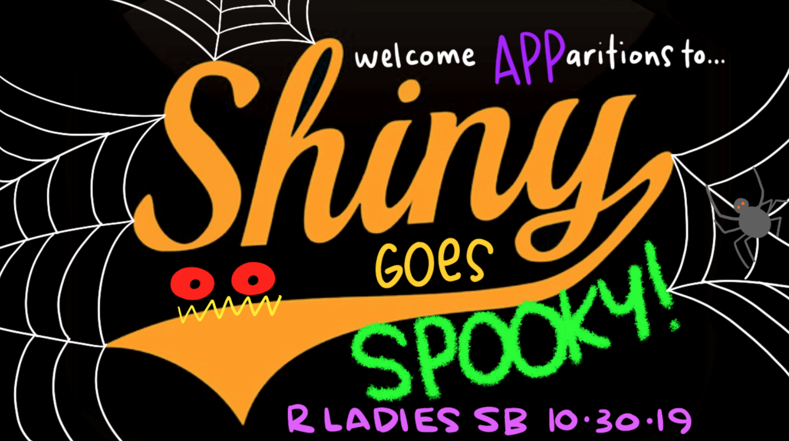

# Basics of building Shiny apps in R with Allison Horst

Welcome!

This session is led by [Allison Horst](https://twitter.com/allison_horst), the awesome lecturer at the Bren School of Environmental Science and Management (UC Santa Barbara). Check out her course materials: [allisonhorst.github.io](https://allisonhorst.github.io). 

[R-Ladies SB intro slides](https://docs.google.com/presentation/d/18eWOBIff-WPrhYQIZyqNAiOXjcU24z_FEb61a0DQ8cE/edit?usp=sharing)

To code along during the session:

- The materials for the workshop are [shared here on GitHub](https://github.com/allisonhorst/shiny-basics-sb-r-ladies). If you're not using GitHub yet, you can still download the materials (Clone or Download > Download ZIP). We'll use the *spooky_data.csv* file, so save that file somewhere you'll be able to find it easily.
- You'll need R & RStudio installed (see instructions for installing/updating from [Jenny Bryan's stat545](https://stat545.com/install.html))
- You'll need the {tidyverse}, {shiny}, and {shinythemes} packages installed

And Happy Halloween!

